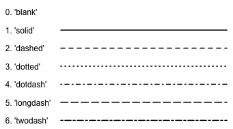

_(20/02/2017)_
```{r setup, include=FALSE}
knitr::opts_chunk$set(echo = TRUE, warning = F, cache = T)
library(ggplot2)
library(ggplot2movies)
library(tufte)
data("movies")
library(dplyr)
```


```{r echo = F}
movies %>%
	mutate(Action = factor(Action, levels = c(0,1), labels = c(F,T)),
		   Animation = factor(Animation, levels = c(0,1), labels = c(F,T)),
		   Romance = factor(Romance, levels = c(0,1), labels = c(F,T)),
		   Comedy = factor(Comedy, levels = c(0,1), labels = c(F,T))) -> movies
saveRDS(movies, "movies.RDS")
data(diamonds)
saveRDS(diamonds, "diamonds.RDS")

```
# Before you start {-}

Before you start this tutorial, make sure to install the package `ggplot2`, if you haven't already done so. You can do this using the following line of code:
```{r eval = F}
install.packages("ggplot2")
```


In any case, you need to load the package into your session 
```{r}
library(ggplot2)
```

You also need two datasets, `movies` and `diamonds`. Both will be provided as a .RDS file with this tutorial. 

```{r eval = F}
movies <- readRDS("movies.RDS")
diamonds <- readRDS("diamonds.RDS")
```


# Introduction {-}

Creating a plot with ggplot2 starts with the `ggplot()` function. The ggplot function has two important arguments 

* 	__data__: this will define the dataset to be used for the plot. This must be a data.frame.
*	__mapping__: the mapping will define how the variables are _mapped_ onto the aesthetics[^1] of the plot, as will be explained further on. This mapping must always be created using the `aes()` function .

For example, we might want to make a scatterplot of the movies in which we use the x-axis for their budget and the y-axis for their rating. We then call ggplot as follows:


[^1]: The _aesthetics_ of a ggplot-graph are the visuals we see in the graph: position, color, shape, size, linetype, etc.

```{r warning=F}
ggplot(data = movies, mapping = aes(x = budget, y = rating))
```

As you can see, this line of code creates a plot with the axes as defined. However, there is no data visualised. The reason herefore is that ggplot doesn't know yet how we want to visualise it. We have to add what is called _a geometric layer_. To create a scatterplot, which consists of _points_, we add `geom_point` to the plot. 

```{r }
ggplot(data = movies, mapping = aes(x = budget, y = rating)) +
	geom_point()

```

This already looks more like it. Remark that the geometric layer was added to the plot by using the `+` symbol. In this way, multiple layers can be added to the same plot, as well as titles, labels, and configurations of the lay-out, as we will see further on. 

Note that we can also place the mapping of the aesthetics in the geometric layer itself. This will make our code slightly more readable for now, as we place the geometric layer and its mapping on the same line.

```{r }
ggplot(data = movies) +
	geom_point(mapping = aes(x = budget, y = rating))
```

We have now created our very first plot! In the following sections we will learn how to use different geometrics and aesthetics and how to enhance the layout of our graphs.


# Different geometrics

Next to `geom_point`, many more different geometrics exist to plot data in ggplot. You can check them out by typing 'geom_' in the console and navigating through the auto-completion list. Each of the geom-layers comes with their own specific set of aesthetics that can (and sometimes need to) be mapped. In this tutorial, we will focus mostly on the following geometric layers:

*	geom_point
*	geom_histogram
*	geom_boxplot
*	geom_violin
*	geom_bar
*	geom_col

## geom_point

We already used `geom_point` to make our first graph, where we mapped two variables on the aesthetics _x_ and _y_. However, there are some more aesthetics which can be set using this layer. Let's look at them in more detail. 

*	__x__:		this will define the position of the points along the x-axis
*	__y__:		this will define the position of the points along the y-axis
*	__color__:	this will define the color of the points
*	__shape__: 	this will define the type of points to be plotted[^2]
*	__fill__: 	this will define how the points are filled (for shapes 21-25)
*	__size__:	this will define the size of the points 
*	__stroke__: 	this will define the width of the border
*	__alpha__: 	this will define the degree of transparancy

[^2]:  Next to a normal point, many different shapes can be plotted in ggplot. This figure shows the most important ones. The shapes can be used by setting the 'shape' aesthetic to the accompanying number. 

For example, the graph below will plot black triangles filled with red with a size of 2. Note that the position of the triangles is exactly the same as the position of the points in the previous plot. 

```{r}
ggplot(data = movies) +
	geom_point(mapping = aes(x = budget, y = rating), 
			   shape = 24, fill = "red", color = "black", size = 2)
```

But wait, there is something important going on here! While the x and y-aesthetics were defined inside the aes-mapping, the other aesthetics were defined outside of it. Why's that?

Actually, aesthetics can be set in two different ways: 

1. They can be _mapped_ to a variable in the dataset.
2. They can be set to one fixed value.

In our example, x and y are mapped to two variables in the data, i.e. budget and rating, while the other aesthetics, shape, fill, color and size, are set to fixed values. Although some of the aesthetics typically are always mapped, such as x and y-positions, some others can be a fixed value as well as a mapped variable. For instance, what happens if we map the color of points to a variable, say the variable Action. 

```{r}
ggplot(data = movies) +
	geom_point(mapping = aes(x = budget, y = rating, color = Action))
```

We see that points are now colored with respect to the value in the variable Action. Action movies receive a green color, while other movies receive a red color, which we can see in the legend that appeared. 

Also the other fixed aesthetics can be used in a mapping. The next example uses the variable Animation for the shape mapping. 

```{r}
ggplot(data = movies) +
	geom_point(mapping = aes(x = budget, y = rating, color = Action, shape = Animation))
```

Great! We now completely understand the geom_point layer, and the working of the aesthetics-mapping. Now it's time to look at some other geometric layers. We start with histograms.

## geom_histogram

The _geom_histogram_ layer can be used to plot a histogram. As you should already know, a histogram represents the distribution of __one__ continuous variable. As a result, there is only an x-aesthetic that should be set, and no y-aesthetic. The complete list of aesthetics is as follows:

*	__x__:		this will define the variable to be used
*	__color__:	this will define the color of the borders
*	__fill__: 	this will define how the histogram is filled 
*	__size__:	this will define the size of the border 
*	__linetype__: 	this will define the type of the border [^3]
*	__alpha__: 	this will define the degree of transparancy
*	__weight__: this will define how observations should be weigthed. By default, each observation is weigthed as one.

[^3]:  Next to a normal line, different other linetypes can be plotted in ggplot. The types can be used by setting the 'linetype' aesthetic to the accompanying number, or to the name of the type. 

Using our knowledge on how to use aesthetics from before, it is now very easy to make a histogram. Let's make a histogram for the rating of movies. We will give it a black border with a white fill. Ready to try?

Let's have a look.

```{r}
ggplot(movies) +
	geom_histogram(aes(rating), color = "black", fill = "white")
```

Note that several things were omitted in these two lines of codes. In particular, the argument name _data_ in ggplot, _mapping_ in geom_histogram and _x_ in aes. Since we know that these are the first arguments of these functions, we can safely omit them, as long as we follow the correct order of arguments. However, we cannot omit _color_ and _fill_, as these are not the second and third argument of geom_histogram. Whenever in doubt, just play safe and write down the proper argument names. 

However, that's not the only thing which is tricky here. Indeed, a warning pops up: `stat_bin()` using `bins = 30`. Pick better value with `binwidth`. This warning reminds us to the fact that a default value for the number of bins is chosen by geom_histogram, which is propably not suitable for our graph. We can change the binwidth by adding it as an argument to the geom_histogram call.

```{r}
ggplot(movies) +
	geom_histogram(aes(rating), color = "black", fill = "white", binwidth = 0.5)
```

Often, the binwidth has an important impact on how the obtained histogram looks like. Carefully configuring this argument by experimenting with different values is therefore important. 

In the last plot, we used a fixed color for filling the bars of the histogram. But as we already know by now, we can also map it to a variable in the data. Let's use the variable _Action_ one more time. 

```{r}
ggplot(movies) +
	geom_histogram(aes(rating, fill = Action), color = "black", binwidth = 0.5)
```

Note how we moved the fill argument inside the `aes`function. Now, each of the bars is filled with two colors: one part for Action movies, and the remainder for other movies. Although it is not very clear in this graph, it appears that the center of the histogram for action movies is slightly more to the left. 

Note how the punctuation changes when moving to the aes-mapping: variable names are always used without quotes, i.e. _bare_ variable names, while fixed aesthetics (colors, shapes, linetypes) are used with quotes (except for numbers). It is important to not mess this up!

By default, the histogram for the different _fills_ are stacked, i.e. placed on top of each other. However, we can use the _position_ argument of geom_histogram to put the bars next to each other, or _dodged_.

```{r}
ggplot(movies) +
	geom_histogram(aes(rating, fill = Action), 
				   color = "black", binwidth = 0.5, position = "dodge")
```

Using position = "dodge", the bars for Action movies and non-Action movies are placed next to each other, instead of on top of one another. We can go back to the original graph by using position = "stack", or just omitting this argument. Later on we will see how to handle such things better by using grids of different plots, or so-called _facets_.

All good so far? Let's look at another way to visualize the distribution of continuous variables, i.e. the boxplot.

##geom_boxplot

A boxplot places the values of the variable along the y-axis. So, if we want to make a boxplot for ratings, we should use `aes(y = ratings)`. However, something tricky is going on here... The aesthetics for geom_boxplot are the following

*	__x__:		this will define the variable used for the x-axis
*	__y__:		this will define the variable used for the y-axis
*	__color__:	this will define the color of the borders
*	__fill__: 	this will define how the boxplot is filled 
*	__size__:	this will define the size of the border 
*	__linetype__: 	this will define the type of the border 
*	__alpha__: 	this will define the degree of transparancy
*	__weight__: this will define how observations should be weigthed. By default, each observation is weigthed as one.

Thus, the boxplot needs both an x-variable and an y-variable? That seems strange at first sight. The reason behind this is that in the philosophy of ggplot, always _something_ must be plot on both x and y-axes. Although only a x-variable is given to a histogram, it will compute frequencies to plot on the y-axis. However, there is no such thing going to happen for boxplots. As a result, the x-axis should be used to map different categories for which the distribution can then be compared. For instance, we can compare the rating for Action movies with those for other movies.

```{r}
ggplot(movies) + 
	geom_boxplot(aes(Action, rating))
```

Here we see that, as we already suspected, Action movies tend to have a lower rating compared to other movies. We can change the color and the fill of the boxplot just like before, as well as the linetype, the size of the border, or the transparency. 

But, what if we just want to plot a boxplot of the overal rating, without having to specify a variable for the x-axis? A little workaround is needed here. One possibility is to use an _empty string_ for the x-axis mapping. 

```{r}
ggplot(movies) +
	geom_boxplot(aes("", rating))
```

Note that this creates the label "x" for the x-axis, where we would normally find the name of the variable mapped onto it. Later we will see how to omit this label to make our graph a little nicer.

##geom_violin

The violin-plot is similar to the boxplot, although it will reflect in more detail where the mass of the values is located. Its aesthetics are the same as for a boxplot. 

*	__x__:		this will define the variable used for the x-axis
*	__y__:		this will define the variable used for the y-axis
*	__color__:	this will define the color of the borders
*	__fill__: 	this will define how the violin is filled 
*	__size__:	this will define the size of the border 
*	__linetype__: 	this will define the type of the border 
*	__alpha__: 	this will define the degree of transparency
*	__weight__: this will define how observations should be weighted. By default, each observation is weigthed as one.

Let's make the same graphs, now using the violin-plot.

```{r}
ggplot(movies) + 
	geom_violin(aes(Action, rating))
```

It's probably clear now where this type of graph got its name from. As you can see, violin plots somehow sit in between boxplots and histograms. However, since their width is normalized, they can be used better for comparison. Also here, we can use the same workaround if we want to plot the overal distribution. 

```{r}
ggplot(movies) +
	geom_violin(aes("", rating))
```

So far, we have seen three different ways to analyse the distribution of continuous variables. Now, we will look into barplots, which can be used to represent categorical distribution.

##geom_bar

Just like a histogram, a barplot only needs an x variable. The difference is that this variable needs to be categorical, while for histograms it needs to be continuous. The full list of aesthetics is the following:

*	__x__:		this will define the variable used for the x-axis
*	__color__:	this will define the color of the borders
*	__fill__: 	this will define how the bars are filled 
*	__size__:	this will define the size of the border 
*	__linetype__: 	this will define the type of the border 
*	__alpha__: 	this will define the degree of transparency
*	__weight__: this will define how observations should be weigthed. By default, each observation is weigthed as one.

We can make a simple bar chart that shows how many Action movies there are, and how many other movies, as follows.

```{r}
ggplot(movies) +
	geom_bar(aes(Action))
```

Furthermore, we could add colors to this, according to the number of Animation movies. We immediately see that there are almost no Action movies which are also animation movies. 

```{r}
ggplot(movies) +
	geom_bar(aes(Action, fill = Animation)) 
```

We can do the same for Romance and Comedy movies. 

```{r}
ggplot(movies) +
	geom_bar(aes(Romance, fill = Comedy)) 
```

In contrast, it can be seen here that approximately half of the Romantic movies are also comedy, which is more compared to non-romantic movies.

Remember that, in case of histograms, we could change the position to "dodge", which placed the bars next to each other. The same can be done here.

```{r}
ggplot(movies) +
	geom_bar(aes(Romance, fill = Comedy), position = "dodge") 
```

A third option that is available for the position is to extend the bars so that they have the same height. As a result, we will observe the distribution of values as a part of a whole. Instead of the count, the labels on the y-axis will now depict the percentage points.

```{r}
ggplot(movies) +
	geom_bar(aes(Romance, fill = Comedy), position = "fill") 
```

Finally, if we want to do this to show the distribution of one variable, we can use the same workaround as before and set the x-aesthetic to "". The plot below will show the portion of all movies that are comedies.[^20]

```{r}
ggplot(movies) +
	geom_bar(aes("", fill = Comedy), position = "fill") 
```

[^20]: Note that in cases like these, it perfectly makes sense to make the plot less wide, or flip it 90 degrees and make it less high. However, these are configurations related to the output devices used, and we will not consider them here. 

##geom_col

When we use geom_bar, the heights of the bars are computed by using the frequency of the categorical variable. However, sometimes we just want to plot a bar chart with values that are already in the data, or values which we computed ourselves. For instance, what if we wanted a barchart depicting the budget of a set of movies? In such a case, we can use _geom_col_. "Col" indicates that we want to use a column in the data to set the height of the bars. The aesthetics are the same for geom_bar, only now we need to specify a variable for the y-axis, evidently. 

*	__x__:		this will define the variable used for the x-axis
*	__y__:		this will define the variable used for the y-axis
*	__color__:	this will define the color of the borders
*	__fill__: 	this will define how the bars are filled 
*	__size__:	this will define the size of the border 
*	__linetype__: 	this will define the type of the border 
*	__alpha__: 	this will define the degree of transparency
*	__weight__: this will define how observations should be weigthed. By default, each observation is weigthed as one.

Let's make a barplot depicting the budget of all movies from 2004 where the budget was higher than 100 million. 

```{r}
filter(movies, year == 2004, budget > 100000000) %>%
	ggplot() +
	geom_col(aes(title, budget))
```

Do you notice something strange in the code? Don't worry if you don't understand the first line. All you need to know is that we filtered movies from 2004 with a budget higher than 100 million. The strange looking %>% symbol will make sure this data is passed to ggplot. We will come back to this in another session. [^4]

[^4]: If you want to try this yourself, make sure the package `dplyr` is installed and loaded before you use the filter.

We have now plotted movie titles on the x-axis and budget on the y-axis. Great! Or not so? The values on the x-asis are somewhat cluttered and unreadable. It's time now to give some attention to the layout of our plots!

## Other geometrics

So far, we used the most important geometrics to make simple visualizations: scatterplots, histograms, boxplots, violinplots and bar plots. However, we only covered the tip of the iceberg, as many more types exist, some simple and some more advanced. An overview of all geoms and their uses can be found in the [ggplot Cheat Sheet](https://www.rstudio.com/wp-content/uploads/2015/12/ggplot2-cheatsheet-2.0.pdf), of which an extract is shown here. Don't be afraid to try something out!


# Enhancing the appearanc of our plots


So far, we have mainly looked at different types of plots and how to map them on our data. In this section, we will focus on the presentation of the plot, e.g. titles, colors, axes, etc. The concepts introduced in this section can be applied for any type of plot, no matter which geometric object is used.

In this section, the dataset "diamonds" will be used. The plot below will be used as a starting point. [^D]

[^D]: The table of a diamond refers to the flat facet of the diamond which can be seen when the stone is faced up. The depth of a diamond is its height (in millimeters) measured from the culet to the table. 

```{r}
ggplot(diamonds) +
	geom_point(aes(table, depth, col = cut))
```


## Titles

One of the most important things to add to our plot are titles. Titles are used to give meaning to the axis as well as the plot itself. The most straightforward way to add titles is to use the function `labs()`. In this function, 4 arguments can be set: the title, the subtitle, x for the x label and y for the y label. The labs function can just be added to the plot as an extra layer.

```{r}
data("diamonds")
ggplot(diamonds) +
	geom_point(aes(table, depth, col = cut)) + 
	labs(title = "Comparing table and depth of diamonds",
		 subtitle = "What combination of table and depth gives good quality diamonds?",
		 x = "Table",
		 y = "Depth")
```

You'll see that our graph already looks much better when titles are added! However, there is much more to improve. 

## Theme

The _theme_ of a plot defines its overall appearance: the gridlines, the background, the size of the text, titles and legend, the position of the legend, etc. The theme can be defined manually by adding a `theme()` layer to the plot and by setting the required arguments. (You can look at ?theme to see the arguments which are avaibable). However, this is a cumbersome approach. Fortunately, some predefined themes are provided in ggplot:

*	__theme_gray__: the default theme (used so far)
*	__theme_bw__: a theme for black-white plots
*	__theme_dark__:	a dark theme for contrast
*	__theme_classic__: a minimal theme
*	__theme_light__: another minimal theme
*	__theme_linedraw__: yet another minimal theme
*	__theme_minimal__: yet another minimal theme
*	__theme_void__: an empty theme

Feel free to experiment with some of these themes. Preferably, you can use some of the minimal themes. Here, we used the theme_light theme. [^6]

[^6]: For most of the layers, it is not important in which order they are added to a plot. However, if you make manual changes with `theme`, make sure to put them after any predefined theme, otherwise your changes will be overwritten.

```{r}
ggplot(diamonds) +
	geom_point(aes(table, depth, col = cut)) + 
	labs(title = "Comparing table and depth of diamonds",
		 subtitle = "What combination of table and depth gives good quality diamonds?",
		 x = "Table",
		 y = "Depth") +
	theme_light()
```

When you are not yet satisfied with any of these themes, you can install the package `ggthemes` to get hold of even more themes, such as the theme from _The Economist_, _fivethirtyeight.com_, or _Google Docs_.

## Configuring the coordinate system

The appearance of the graph is not only defined by the titles and the graphics. Also the axes in the coordinate system need some attention. One thing to decide on are the limits of the coordinate system. This can be done using the function `coord_cartesian` and its arguments _xlim_ and _ylim_. Both arguments expect a numerical vector of length two. Let's see how this works in our example. [^7]

[^7]: A Cartesian coordinate system is a coordinate system that specifies each point uniquely in a plane by a pair of numerical coordinates, which are the signed distances to the point from two fixed perpendicular directed lines, measured in the same unit of length. 

```{r}
ggplot(diamonds) +
	geom_point(aes(table, depth, col = cut)) + 
	labs(title = "Comparing table and depth of diamonds",
		 subtitle = "What combination of table and depth gives good quality diamonds?",
		 x = "Table",
		 y = "Depth") +
	theme_light() +
	coord_cartesian(xlim = c(45,75), ylim = c(50, 75))
```

We have now limited the x-axis to the interval from 45 to 75, while we have limited the y-axis to the interval 50 to 75. There are some alternatives to the cartesian coordinate system which are less often used. Notable ones are:

*	coord_equal: a coordinate system where the x-axis and y-axis are scaled equally (i.e. ration = 1)
*	coord_fixed: a coordinate system with a fixed ratio
*	coord_polar: a coordinate system for polar plots, or pie charts
*	coord_map:	a coordinate system for plotting geographical data. 

Next to setting the limits of the coordinate system, we can also set the breaks on the x-axis and y-axis. This can be done using the functions `scale_x_continuous` and `scale_y_continuous` respectively. Both functions have a _breaks_ argument. This argument can be given a vector of values to be plot as labels on the axis.[^8] We can use the function `seq` to create this vector: i.e. `seq(0,10,5)` will return a vector starting at 0 and increasing to ten with intervals of 5. [^9]

[^8]: Note that the scale_._continuous functions also have an argument `limits` to set the limits of the axes which can be used instead of coord_cartesion. However, there is a tricky difference. Coord_cartesian will zoom into the limits withouth throwing away other data points. Setting the limits within the scale functions, however, will throw away data points and can bias your visualisation. 

[^9]: The titles of the axes which we defined with the  `labs` function can also be set in the scale functions with the argument `name`. As you get more familiar with using ggplot2, you will often find that there are multiple ways to reach the same goal.

```{r}
ggplot(diamonds) +
	geom_point(aes(table, depth, col = cut)) + 
	labs(title = "Comparing table and depth of diamonds",
		 subtitle = "What combination of table and depth gives good quality diamonds?",
		 x = "Table",
		 y = "Depth") +
	theme_light() +
	coord_cartesian(xlim = c(45,75), ylim = c(50, 75)) +
	scale_x_continuous(breaks = seq(45,75,5)) +
	scale_y_continuous(breaks = seq(50,75,5))
```

Another useful function is the `coord_flip` function, which we will illustrate with the following graph we saw earlier. 

```{r}
filter(movies, year == 2004, budget > 100000000) %>%
	ggplot() +
	geom_col(aes(title, budget))
```

As you may remember, the movie titles on the x-axis were overlapping and therefore unreadable. One way to fix this is to _flip_ the entire graph, such that the labels of the x-asis are placed on the y-axis, and can be read horizontally.


```{r}
filter(movies, year == 2004, budget > 100000000) %>%
	ggplot() +
	geom_col(aes(title, budget)) +
	coord_flip()
```

Another option is to keep the original orientation, but the change the orientation of the labels on the x-axis. You could rotate them by 45 or 90 degrees, for instance. This can be done with the `theme` function. Ready to experiment? Challenge yourself!

As our code contains more and more lines, our plot is getting nicer and nicer! Good job! The last thing on our list are colors.

## Color scales

Often, we use color or fill to visualise categorical data, such as the quality of the cut in our graph about diamonds. By default, ggplot will use a rainbow theme. However, many more palettes are available. We can add these by using `scale_color_brewer` or `scale_fill_brewer`, depending on whether it concerns a color or fill-color. Both layers have a palette argument, of which the possible values can be found below.


For instance, let's use the Set1 pallete.

```{r}
ggplot(diamonds) +
	geom_point(aes(table, depth, col = cut)) + 
	labs(title = "Comparing table and depth of diamonds",
		 subtitle = "What combination of table and depth gives good quality diamonds?",
		 x = "Table",
		 y = "Depth") +
	theme_light() +
	coord_cartesian(xlim = c(45,75), ylim = c(50, 75)) +
	scale_x_continuous(breaks = seq(45,75,5)) +
	scale_y_continuous(breaks = seq(50,75,5)) +
	scale_color_brewer(palette = "Set1")
```

The scale_._brewer functions also have the argument `name`, which we can use to set the name of the legend, and the argument `guide`, which will remove the legend if set to FALSE.

```{r}
ggplot(diamonds) +
	geom_point(aes(table, depth, col = cut)) + 
	labs(title = "Comparing table and depth of diamonds",
		 subtitle = "What combination of table and depth gives good quality diamonds?",
		 x = "Table",
		 y = "Depth") +
	theme_light() +
	coord_cartesian(xlim = c(45,75), ylim = c(50, 75)) +
	scale_x_continuous(breaks = seq(45,75,5)) +
	scale_y_continuous(breaks = seq(50,75,5)) +
	scale_color_brewer(palette = "Set1", name = "Diamond Cut Quality")
```

Next to the standard color palettes avaiable, many more can be found in the packages `ggthemes` and `ggsci`. They can be used by adding _scale_color_+ name of the palette. Feel free to explore some more!

# Advanced plots

Often, you want to compare plots for different categories of a variable. In our example, we looked for which combinations of table and depth, the cut of the diamond was good. We now want to know whether there is a difference between the 8 different clarity levels in the data. One way would be to make 8 different plots, one for each of the levels. However, this would be cumbersome to put together. Fortunately, we can use the function  `facet_grid` to create different plots within a plot. 

## Using Facets

This function expects a formula in the form of ` A ~ B ` where A and B are two categorical variables. For each combination of values of A and B, a different plot will be constructed, and they will be arranged in a grid where the values of A each constitute a row and the values of B each constitute a column. Comparisons of more than 2 variables are possible using a formula of the form `A + B ~ C `. A comparison along one variable is possible by using a dot instead of a variable name, i.e. ` . ~ A ` or `A ~ .` .

In the following plot, we use facets to redraw our plot for each of the clarity levels. Furthermore, the legend is placed on top to create more space.

```{r fig.fullwidth = TRUE, fig.width = 15}
ggplot(diamonds) +
	geom_point(aes(table, depth, col = cut)) + 
	labs(title = "Comparing table and depth of diamonds",
		 subtitle = "What combination of table and depth gives good quality diamonds?",
		 x = "Table",
		 y = "Depth") +
	theme_light() +
	coord_cartesian(xlim = c(45,75), ylim = c(50, 75)) +
	scale_x_continuous(breaks = seq(45,75,5)) +
	scale_y_continuous(breaks = seq(50,75,5)) +
	scale_color_brewer(palette = "Set1", name = "Diamond Cut Quality") +
	facet_grid(. ~ clarity) +
	theme(legend.position = "top")
```

An alternative, mostly suitable for comparisons along one variable, is facet_wrap. Instead of making one row (like facet_grid does), it will order the plots in a grid with a specified number of columns or rows. Below, we ordered them in 3 columns.

```{r fig.fullwidth = TRUE, fig.height=7}
ggplot(diamonds) +
	geom_point(aes(table, depth, col = cut)) + 
	labs(title = "Comparing table and depth of diamonds",
		 subtitle = "What combination of table and depth gives good quality diamonds?",
		 x = "Table",
		 y = "Depth") +
	theme_light() +
	coord_cartesian(xlim = c(45,75), ylim = c(50, 75)) +
	scale_x_continuous(breaks = seq(45,75,5)) +
	scale_y_continuous(breaks = seq(50,75,5)) +
	scale_color_brewer(palette = "Set1", name = "Diamond Cut Quality") +
	facet_wrap( ~ clarity, ncol = 3) +
	theme(legend.position = "top")
```

## Reordering barplots

When working with barplots it might happen that you want to order the bars in a increasing or decreasing fashion. Consider again the example below.


```{r}
filter(movies, year == 2004, budget > 100000000) %>%
	ggplot() +
	geom_col(aes(title, budget)) +
	coord_flip()
```

To do this, we can use the `reorder` function. The reorder function has two arguments: the variable to reorder, in this case the movie titles, and the variable to use for reordering, in this case the budget.


```{r}
filter(movies, year == 2004, budget > 100000000) %>%
	ggplot() +
	geom_col(aes(reorder(title, budget), budget)) +
	coord_flip()
```

Can you find how to reorder the movies in the reverse direction?

## Combining multiple geometric layers

So far, we only used one geometric layer at a time. However, it is perfectly possible to combine different layers. For instance, we can use the `geom_text` label to add data labels to a bar plot. Geom_text is a geometric layer which we can use, indeed, to put text in a graph. We didn't see geom_text before, however, its working will be straigtforward, based on all the things we already know. We build further upon the last graph, which we have given a slightly nicer appearance

```{r fig.width = 10, fig.fullwidth = T}
filter(movies, year == 2004, budget > 100000000) %>%
	ggplot() +
	geom_col(aes(reorder(title, budget), budget/1000000), fill = "grey") +
	coord_flip() +
	labs(title = "Movies budgets",
		 subtitle = "What was the budget of the movies from 2004 with a budget higher than 100 million?",
		 x = "Title",
		 y = "Budget (in million dollars)") +
	theme_light()
```

Note that we changed the y-aesthetic to budget/1000000, such that the values are in millions. Furthermore, it is important to remark that, since we used coord_flip, our labels set in labs also switched. Thus the x-label appears on the y-axis and the y-label on the x-axis. This is exactly what we would prefer, as removing coord_flip in the future  won't mess up the labels.

We would now like to put the exact number of millions on top of the bars. In order to do this, we add geom_text, and give it the same mapping for x and y as the geom_col layer. Furthermore, we add a mapping for the label, i.e. the text to be displayed. We give the text a bold fontface and a white color. Finally, setting hjust to 1 will make sure that the textlabels are horizontally aligned to the left. This makes sure that the text is entirely within the bars, and doesn't fall out of them.

```{r fig.width = 10, fig.fullwidth = T}
filter(movies, year == 2004, budget > 100000000) %>%
	ggplot() +
	geom_col(aes(reorder(title, budget), budget/1000000), fill = "grey") +
	geom_text(aes(reorder(title, budget), budget/1000000, 
				  label = budget/1000000), color = "white", fontface = "bold", hjust = 1) +
	coord_flip() +
	labs(title = "Movies budgets",
		 subtitle = "What was the budget of the movies from 2004 with a budget higher than 100 million?",
		 x = "Title",
		 y = "Budget (in million dollars)") +
	theme_light()
```

The addition of the second geom layer seemed a little bit cumbersome, as we needed to repeat the mapping for x and y, which was made even worse because it involved the reorder function and the division by a million. Surely, there is a better way to do this? We call it aes-inheritance.

## Aes-inheritance

Aes-inheritance, or inheritance of the aes-mapping, means that each of the geom layers which is added to a `ggplot` call _inherits_ the mapping which is specified in that ggplot function call. As you may remember from the very beginning, an aes-mapping can be placed in both geom layers as in ggplot. In the end, we learn there is a little but importance difference. 

When different layers have (part of) a mapping in common, it is best practice to move this part to the `ggplot` call. As such, you don't have to repeat this in any of the layers which use it. And, if any of the layers doesn't use this mapping, you can easily overwrite it by specifying a new mapping whithin that layer. Let's look at an example.

The previous plot we made can more easily be made as follows:

```{r fig.width = 10, fig.fullwidth = T}
filter(movies, year == 2004, budget > 100000000) %>%
	ggplot(aes(reorder(title, budget), budget/1000000)) +
	geom_col(fill = "grey") +
	geom_text(aes(label = budget/1000000), color = "white", fontface = "bold", hjust = 1) +
	coord_flip() +
	labs(title = "Movies budgets",
		 subtitle = "What was the budget of the movies from 2004 with a budget higher than 100 million?",
		 x = "Title",
		 y = "Budget (in million dollars)") +
	theme_light()
```

By moving the mapping for x and y to ggplot, there is no mapping needed in geom_col, and only a mapping for label in geom_text. Both geom layers inherit the other part of the mapping for the ggplot function call. Truly, this seems far more efficient!

# Background material

By now you already master a great deal of plotting with ggplot2. You have both learned how to use different geometric layers to represent data, how to combine them, how to use facets, how to make your code more efficient using aes-inheritance, and last but not least, how to give your plot a nice appearance. Congratulations!

If you are eager to learn even more, you might have a look at the following background materials:

*	[The ggplot Cheat Sheet](https://www.rstudio.com/wp-content/uploads/2015/03/ggplot2-cheatsheet.pdf), which provides an overview of all basic functionality in the ggplot2 package.
*	[The ggplot documentation](http://docs.ggplot2.org/current/)
*	[An even more comprehensive ggplot2 tutorial](http://tutorials.iq.harvard.edu/R/Rgraphics/Rgraphics.html)


