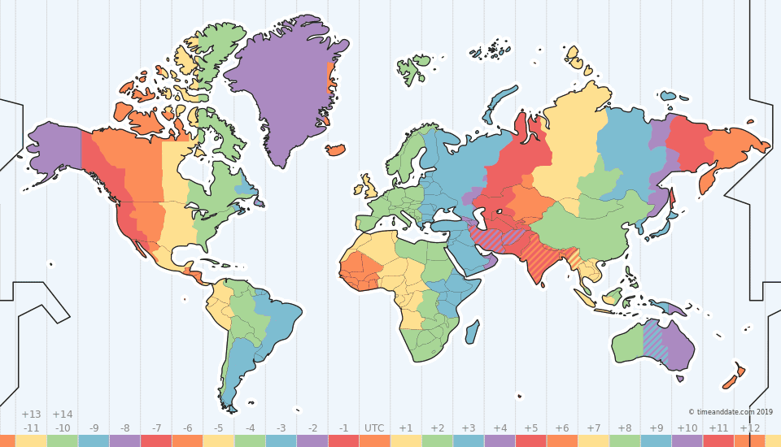

# Before we start {-}
```{r echo = F}
message(glue::glue("Last updated on {lubridate::today()}"))
```

```{r message = F}
library(dplyr) 
library(lubridate)
```

Congratulations on reaching the final tutorial of this course. In this tutorial we will be playing with dates and times. To do this in an easy way, we will use the package lubridate, which you might need to install. We will also load dplyr for when we will use time in a data.frame context. We will not need any dataset, we will make all data ourselfs (How cool is that?). 


## Disclaimer {-}

-	This is a new tutorial and will likely contains typos and other errors. If you find one, please send to gert.janssenswillen@uhasselt.be. You will be repayed with eternal kindness (but not on exams.)

# Introduction

In current _times_, time data is very important, so it is crucial that you know how to work with it. If you think about it, there are so many types of data which have a time component. Just look at the different datasets we have been using.

- order data (each order is created, packed, shipped etc at a certain moment)
- terrorism data (each terrorism attack happened at a certain point in time, sadly)
- gapminder data (we had information on several years)
- nydeaths (deaths happen at a specific moment)
- flights depart and arrive at a specific time (and are sometimes delayed)
- concerts (concerts take place at a specific moment, tickets are bought at a specific moment)

Time is everywhere! 

Except... well, yeah... you got me there: diamonds had nothing to do with time. But trust me, you'll sooner find order data in your future career than diamond data. 

In essence, time and dates behave a lot like a continuous variable. You can compare two dates and see which one was later. You can compute the time difference between two dates. Most things that work for numbers will in a way also work for times or dates. 

Allright, continuous data. So what's all the fuss about?

Well, time is a bit more complex. For starters, it has different components. Let's start with looking at some dates.

# What's in a date?

Easy question: days, month, and year. 

Of course, the tricky part is the order. Some first write the year, some the day. Some will write 1998, other will say 98. There is really no order you can think of which you cannot use. And then ther are different separators like spaces, -, ., /.  Let's look at this completely random date, which we have noted down in different formats. 

* 1991-06-28
* 28 06 1991
* 28 June 91
* June 28, 1991
* 280691
* 1991/06/28

The possibilities are endless. However, thanks to lubridate, we don't need to bother much. We only need to know the order of the compoments Day, Month and Year. 

Consider the following code. We create a character containing the date above.

```{r}
date <- "1991-06-28"
```

Let's say I want to know the difference between that day and today. The following will obviously not work. 

```{r echo = F}
cat("\"",as.character(today()), "\"",  " - \"1991-06-28\"", sep = "")
```

I don't know about you, but I have learned that we cannot substract two words from each other. What about if we remove the "'s?

```{r}
2019-04-29 - 1991-06-28
```

Unless we can travel it time, 28-06-1991, happened almost 28 years before 29-04-2019, not 39 years in the other direction. The difference is also not 39 days or 39 months. I assume you see what's going on here. 

What we need is a new type of object. Not character, not numeric, not integer, not factor. We need a date!

We can make a date with the aptly-named 'make_date' function in lubridate, where we can give year, month and date as an argument.

```{r}
date <- make_date(year = 1991, month = 6, day = 28)
```
```{r}
date
```

Printing it doesn't really change a thing. Let's look at the class. [^date]

[^date]: The words date and data are too different things. It's again a common source of typos. 

```{r}
class(date)
```
Well, that seems alright.

Let's make a bunch of dates - let's say each day in april. Do you still remember the code blow? We saw it to create data.frames a long time ago. We use tbl_df to transform the data.frame to the easier to print tibble format. 

```{r}
dates_of_april <- data.frame(year = 2019,
		   month = 4,
		   day = 1:30) %>%
	tbl_df()
dates_of_april
```

Using mutate, we can now add the date as a separate variable.

```{r}
dates_of_april %>%
	mutate(date = make_date(year, month, day)) -> dates_of_april
dates_of_april
```
Look again at the type of this variable. It's called a Date.

```{r}
dates_of_april %>%
	glimpse
```


Of course, this only solves part of the problem. How do we go from something as "28-06-1991" to 28 and 6 and 1991 to a date? Suppose we have a table of dates where each date is stored as a character, like below. [^unite] 

[^unite]; You can actually make this table yourself by uniting the year, month, day column of dates_of_april using tidyr's unite. 

```{r echo = F}
dates_of_april_text <- dates_of_april %>% tidyr::unite(date, year, month, day, sep = "-")

```

```{r}
dates_of_april_text
```

Look closely, this date column is not a 'date', it is a character.

```{r}
dates_of_april_text %>%
	glimpse()
```

However, using separate, we could separate these characters, and then applying make_date.

```{r}
library(tidyr)
dates_of_april_text %>%
	separate(date, into = c("year","month","day")) %>%
	mutate(date = make_date(year, month, day))
```

Of course, that's a lot of work, which we don't like. However, we can use lubridate. Not only can it make dates from its components, it can also detect these components from a character! We only need it to tell the order of the component.  

Since year is written down first, then month, then day, the order of components is _ymd_. Well, there is a function in lubridate with that name. Let's try with our earlier date. 

```{r}
date <- ymd("1991-06-28")
date
```

 Let's make a second date for today. [^todayy]
 
 [^todayy]: Of course, this is not the day when you are reading the tutorial, but the last day that the tutorial was updated. 
 
```{r echo = F}
date2 <- today()
```

```{r echo = F}
cat("date2 <- ymd(\"",as.character(today()), "\")", sep = "")
```

```{r}
date2
class(date2)
```

There is actually a very useful function in lubridate for getting the date of today. It's just to `today()`

```{r}
today()
```

When the date components are in a different order, you just have to change the order of the letters y, m and d. The following functions are all provided by lubridate.

*	dmy
*	dym
*	mdy
*	myd
*	ymd
*	ydm

Here are some examples. 

```{r}
ymd("2017-03-25")
dmy("25-03-2017")
mdy("03-25-2017")
ymd("17/03/25")
ymd("20170325")
ymd("170325")
```

Note that lubridate will automagicaly find the components as long as it knows the order in which to look for - you don't have to worry about how it is separated, whether month and days are written with or without a leading zero (i.e. 1/4/2019 or 01/04/2019), or whether years are written with 2 or 4 numbers. Lubridate is even so smart it will try to guess the correct century. Suppose we define the date we saw earlier, 28th June 1991, but only give lubridate year 91. 

```{r}
ymd("910628")
```

It turns 91 into 1991. But if we give it year 19 (i.e. the same day in 2019), it will turn 19 in 2019. 

```{r}
ymd("190628")
```

This is very helpful of course (unless we are looking for the year 1919). However, after the [Y2K bug](https://www.britannica.com/technology/Y2K-bug), we will typically find yyyy-dates. [^century]

[^century]: Fun fact for geeks: lubridate will try to find a date within 50 years from now. Thus, all number from 69 to 99 will be regarded as 1999 to 1999, all other numbers will be regarded as years in the 21st century. 


So, let's go back to our table. 

```{r}
dates_of_april_text
```

Luckily, ymd works with vectors, as well as with singular dates. So, instead of this

```{r eval = F}
dates_of_april_text %>%
	separate(date, into = c("year","month","day")) %>%
	mutate(date = make_date(year, month, day))
```

we can now just do this

```{r}
dates_of_april_text %>%
	mutate(date = ymd(date))
```

which obviously is a lot easier. 

Of course, there are always times when lubridate can make mistakes. Consider the funny first day of april. In some parts of the world, they write dates in a month-day-year order, especially in the [United States](https://en.wikipedia.org/wiki/Date_and_time_notation_in_the_United_States). 

Thus, the first day of april is written down as 04-01-2019. If we would see this day without any context, we would wrongly that 4 is the day, 1 the month and 2019 the year. Thus, 

```{r}
dmy("04-01-2019")
```

Lubridate will not see any problems because this is not an incorrect date. But, we are no longer taking about the first of April. We are talking about the 4 of January. The second of april will become the 4th of February using this code. Lubridate will sense that something is going wrong when we get to the 13th of april. 

```{r}
dmy("04-13-2019")
```

Now lubridate will fail to see this as a correct dmy-date, and return an NA. However, it is good to know that lubridate doesn't learn very good from its mistakes. Suppose we have again a whole data set of dates in this format. [^us_create]

[^us_create]: You can create this table yourself by uniting the columns dates_of_april table in the month, day, year order. 

```{r echo = F}
dates_of_april %>%
	unite(date, month, day, year, sep = "-") -> dates_of_april_us
```

```{r}
dates_of_april_us
```

When we try to convert is in a date using the wrong order, dmy. We get the following. 

```{r echo = F}
dates_of_april_us %>%
	mutate(date = dmy(date)) %>%
	print(n = Inf)
```

```{r eval = F}
dates_of_april_us %>%
	mutate(date = dmy(date))
```

Note that all dates till the 13th are (wrongly) converted. The remaining ones are not converted and replaced with NA, of which lubridate warns us. However, he's not so smart to correct our mistake and replace the first 12 days with NA. [^shuffle]

[^shuffle]: Not that lubridate date doesn't learn retroactively (replacing the already converted dates with NA), but is also doesn't learn for the future. If we shuffle the data such that we'll see a wrong date faster, it will still wrongly convert all of the 12 first days of april. So he will always do his best, even if he has already had problems with some dates. Moral of the story: the data scientist should never be asleep and blindly trust tools. 

Let's return to our dates we defined ealier

```{r}
date
date2
```
We can now calculate with these dates.

```{r}
date2 - date
```

Problem solved. Let's add some other problems. 

# There's always time

Instead of dates, we can also have times. In this tutorial, we will only consider the combination of date and time, which we call a _datetime_. We can look at an example using the function `now`. While `today` gives us the date of today, `now` gives us the date time of, well, now. 

```{r}
current_time <- now()
current_time
class(current_time)
```

The class of a datetime is no longer a "date", it is a "POSIXct" and "POSIXt". [^posixct] 

[^posixct]: What the hell does that mean? POSIXct is the number of seconds sinds the start of the first of January in 1970. R uses this number of seconds to store a datatime. Another way to store it is by storing, seperately the seconds, minutes, hours, etc. Then it is a POSIXlt. The difference between those to will not change for the user, only how the date is stored. POSIXt is a parent class which makes sure that most functions can work with both types of storage. There's no need to remember these names. Just know that everything starting with POSI is a datetime, not just a date. 


Similarly to dates, we can create datetimes in two ways. 

1.	Using make_datetime, and giving all components (hours, minutes, seconds and timezone).
2.	Using ymd_hms, and giving a character. 

Next to ymd_hms, there's also dmy_hms, mdy_hms, etc. However, hours, minutes and second should always be in the same order. There is no ymd_smh for instances. But, we will never find a datetime in that format either, so no worries. There _is_ a ymd_hm and a ymd_h (and this for all ymd orders), which we can use if we just have the hour, or the hour and the minutes, but not the more detailed parts. 

You will mostly use ymd_hms. Let's see some examples. Note that the third notations, with a T between the date and time part, is very common in datasets, and lubridates takes care without problems. 

```{r}
dmy_hms("25-03-2017 10:30:00")
dmy_hms("25032017103000")
dmy_hms("25-03-2017T10:30:00")
ymd_hms("2017-03-25 10.30.00")
dmy_hms("25-03-2017 10h30m00s")
dmy_hm("25-03-2017 10:30")
```

Again, you can use this on entire columns using mutate. Also, make sure to check what the actual order of components is. We already saw that lubridate can make mistakes also. 

Onces we have datetimes, we can again do calculations with them. 

```{r}
datetime <- dmy_hms("25-03-2017 10h30m00s")
now() - datetime
```

Or compare them.

```{r}
now() < datetime
```

We'll learn a lot more what we can do with dates, but there is still one more hurdle to take. 

# My time is not your time

So, handling time is not much more difficult from handling dates. Just add a few additional letters to the ymd functions. This is mainly true if you stay in the same place, like a tree. Once you start moving to different countries, time gets more difficult. Just crossing the North Sea channel and we have to change our clocks. 

Below, you can see a map of all different time zones. 

```{r fig.align = "center", echo = F}

```

When you graduate from this program you'll most certainly become successful international businessleaders, so having a basic understanding about time zones is necessary. Let's again look at the current time. 

```{r}
now()
```

The last part of this time tells us the timezone we are in. At my pc, it currently says CEST, which is the Central European Summer Time [^tz]. You also check the time zone you are in using Sys.timezone(). 

```{r}
Sys.timezone()
```
At this point, my pc tell me it is Europe/Paris instead of CEST. Indeed, there are multiple names for the same zone. It's all a great master scheme to get you confused. 

The function olson_time_zones gives you a list of all time zones according to the Olson time database. This is notation of time zones using Continent/City. It is named after Arthur Olson

```{r eval = F}
olson_time_zones()
```
Just try this in your console. It's a long list, and we don't want to spoil the environment with our paper usage. 

[^tz]: Note that if you read the online version of this tutorial, the time zones you see here may be different because it might be compiled on a server in a different time zone.

When we are creating a date with a ymd_hms-variant, it will automatically use UTC as a time zone. 

```{r}
ymd_hms("2017-03-25 10.30.00")
```


UTC is the Universal Coordinated Time, i.e. the standard, base-line time zone. CEST is UTC + 2, i.e. two hourse ahead of UTC. We can change that be setting the tz argument within the ymd_hms function. Let's first take a more meaningful datetime. 

```{r}
ymd_hms("2017-01-20 17:30:00")
```


At time a sad event happened in Washinghton DC. So let's define the time zone appropriately. 

```{r}
ymd_hms("2017-01-20 11:30:00", tz = "EST")
```

Note that EST is the Eastern Standard time, the time zone used in winter in DC. You can see that the time doesn't really change, only the indication of the timezone. 

We can now see what time it was back in Belgium, by showing this time in CET (Central European Time, that is, our winter time).

First, we save the time as "doomsday"

```{r}
doomsday <- ymd_hms("2017-01-20 11:30:00", tz = "EST")
```

Using with_tz, we can show a point in time in a different timezone. 

```{r}
with_tz(doomsday, "CET")
```

So, at 11.30 in Washington, it was 17.30 here in Belgium when we were whatching the terrifying events occur live on your tv screens. 

But, both refer to the same point in time. They are just different representations of that same point.

```{r}
doomsday_in_belgium <- with_tz(doomsday, "CET") 

doomsday_in_belgium - doomsday
```

If we really want to change the time zone, i.e. refer to 11.30 in Belgium, we can use force_tz instead. 

```{r}
force_tz(doomsday, "CET")
```

At this point, we are not longer talking about the same point in time, but we are talking about the time 6 hours before doomsday. 

```{r}
force_tz(doomsday, "CET") - doomsday
```

We'll come back to time zones in a minute, because even in Belgium we change our clocks now and again (at least for now). First, let's have a look at the things we can do with dates and times. 


# Extract information from dates

When we have a date (or datetime), we can easily extract information from it. For example, consider doomsday again. 

We can see which day it was. 

```{r}
day(doomsday)
```

or at which hour

```{r}
hour(doomsday)
```

or even which day of the week 

```{r}
wday(doomsday)
```

It was the 6th day of the week. But if you remember doomsday as well as I, you will have it printed on your eyelids that it was a terrible friday?

Indeed, lubridate will start counting on sunday - another American quirk. So, sunday is the first day of the week. Saturday the seventh. And friday the sixth. 

Luckily, the wday function has an argument label, which we can set to TRUE when we forgot the exact meaning. 

```{r}
wday(doomsday, label = TRUE)
```

Friday it was. Not that it is automatically an ordered factor, which is helpful. Also note that it might not be in English on your pc. Time is a little different for each of us. 

We can also ask for the month of doomsday as both a number and a label. 

```{r}
month(doomsday)
month(doomsday, label = T)
```
Or course, the first month of the year is Januari. Even in the US. (Might not be so in China though). 

Using these functions we can look at time data from very different angles. We can compare months, days of the week, hours, etc. It shows how complex time is, but also in how different ways we can use it to analyse something. That's why it's so important to know. 

# Time differences

There are three different ways to express a time difference. 

-	A period
-	A duration
-	An interval

A period is expressed in components: hours, days, months, years. It is how we _perceive_ time

A duration is expressed as an amount of seconds. It is like the a machine or clock counts time. 

An interval is a _exact_ window of time, with a specific start date(time) and a specific end date(time). It is something totally different from periods and durations. Let's look at those first. 

## Period

We can create a period with the period function, by giving it a number of components. 

```{r}
period(days = 2, minutes = 4, seconds = 70)
```

Note that it will just give us the period in easy to understand chunks of time. 2 hours, 4 minutes and 70 seconds. It won't even change it to 2 hours, 5 minutes and 10 seconds, because that's not what we said. Periods have a human touch to it. 

If our can be easily expressed in a single component, we can use the follow that components day (in plural). 

```{r}
days(3)
weeks(3)
months(2)
years(4)
```

We need to use the plural (days, not day), because we already used day to extract the day from a date (remember?). When we use weeks, it will translate each week to 7 days. When we use months or years, it will created additional components in its output.

We can combine them.

```{r}
days(1) + hours(1)
```


We can also make negative periods.

```{r}
days(-10)
```

Or we can make vectors of periods.

```{r}
period(days = 1:5, hours = 3:7)
days(0:6)
```

We can than also substract or add these periods to dates. Thus, if today is 

```{r}
today()
```

the next 6 days are 

```{r}
today() + days(1:6)
```

## Durations

Instead of using these human-understandable components, durations translate all time difference to seconds. Just like `period`, we can use  `duration`.

```{r}
duration(days = 2, minutes = 4, seconds = 70)
```

As you see, it will always try to give an approximation of the time differences in understandable terms for us, humans. 

Indeed, we can also do the math
```{r}
2*24*3600+4*60+70
```

Similarly, we can use ddays, dweek, dyears, etc. [^dday]

[^dday]: Evidently, this has nothing to do with D-Day. It's just dat day and days were already taken, and d stands for duration.

```{r}
ddays(3)
dweeks(3)
dyears(4)
```


We can combine them.

```{r}
ddays(1) + dhours(1)
```

We can not make negative durations, but it wont really give an error. 

```{r}
ddays(-10)
```

Note that there is no such thing as a negative second. 

We can make vectors of periods.

```{r}
duration(days = 1:5, hours = 3:7)
ddays(0:6)
```

We can than also substract or add these durations to dates. Thus, if today is 

```{r}
today()
```

the next 6 days are 

```{r}
today() + ddays(1:6)
```


Note that we cannot compute dmonths!

```{r error = T}
dmonths(1)
```
There is no fixed length for months in number of seconds, of course. [^years_fixed]

[^years_fixed]: You might wonder that there is also no fixed length for years, depending on whether we have a leap year or not. True, but dyears will implicitly use the common conventions that a year has 365 days, which is true more than 75% of the time. We don't have such a convention for months. 

Now, you wonder, why do we have both periods and durations? Well, there are some important differences.

## Periods are not durations

As I already mentions, durations are machine-interpretable seconds, and periods are human-interpretable days. 

If we, humans, say "next month" on the 3th of februari, we mean the 3th of march. A machine wouldn't know what a month is. 

Let's look at some examples too make things clear. 

Let's take the first day of 2019, which is not a leap year. 

```{r}
ymd("2019-01-01")
```

If we add a period-year

```{r}
ymd("2019-01-01") + years(1)
```

or a duration-year

```{r}
ymd("2019-01-01") + dyears(1)
```

both are the same, because how we perceive the length of 2019 (i.e. 365 days), is exactly the duration of a year.

However, if we add 2 years, there is a difference, because 2020 is a leapyear and how we perceive it (366 days) is not the same as the duration of a default year. 

```{r}
ymd("2019-01-01")
```

If we add two period-years

```{r}
ymd("2019-01-01") + years(2)
```

or two duration-years

```{r}
ymd("2019-01-01") + dyears(2)
```

"Next year" on New Year 2020 for us humans means New Year 2021, eventhough it is a leapyear. For durations, it means New Years Eve, because it assumes a year has 365 days. 

Let's take another example. On 31 march we changed from our winter time (CET) to summer time. What does it mean to add "a day" to 4pm on saturday. 

```{r}
ymd_hms("2019-03-30 16:00:00", tz = "CET") + days(1)
ymd_hms("2019-03-30 16:00:00", tz = "CET") + ddays(1)
```
If we add a human period, it will say 4pm on sunday, eventhough that's only 23 hours later. If we a machine-duration, it will tell us that "a day later" is sunday at 5pm, because only then have 24 hours passed. 

Of course, there is no difference on any other day of the year. 

```{r}
ymd_hms("2019-04-30 16:00:00", tz = "CET") + days(1)
ymd_hms("2019-04-30 16:00:00", tz = "CET") + ddays(1)
```

So, the difference is only in special cases, but a difference still. 

# Arithmetics

We've already seen quite a lot of computations we can do. Here are some other examples. 

```{r}
doomsday >= now()
now() - doomsday
as.period(now()-doomsday)
doomsday + period(1,"week")
leap_year(2012)
leap_year(now())
now() + weeks(0:2)
```

Sometimes, calculations can go wrong. Especially with months.

```{r}
ymd(20190331) + months(1)
```
Well, the 31st of April doesn't really exist. (I suppose we all would like to have an extra 24 hours, but we don't.)

You can use the special %m+% operator to make sure that your additions never go over the months end. 

```{r}
ymd(20190331) %m+% months(1)
```

Below, we have tried both to create a list of every months last day this year.
```{r}
ymd(20190131) + months(0:11)
ymd(20190131) %m+% months(0:11)
```

# Interval

Finally, let's look at interval. Durations and periods only have a length. A period or a duration of a specific length can occur at any time. 

An interval is different, as it refers to on specific window in time. It is not defined by its length, but rather by its start and end point. 

Victor Hugo lived from February 26, 1802 until May 22, 1885. So we can define an interval using these two dates which represents his lifetime

```{r}
hugo <- interval(mdy(02261802), mdy(05221885))
hugo
class(hugo)
```

Note that we can of course also use datetimes to define an interval. (We just don't have any specific information on Hugo's hour of birth or death.)

Oscar Wilde lived from October 16, 1854 until November 30, 1900. Thus, 

```{r}
wilde <- interval(mdy(10161854), mdy(11301900))
wilde
```

We can also create an interval with the special %--% operator. Thus the code above is equivalent to 

```{r}
wilde <- mdy(10161854) %--% mdy(11301900)
wilde
```

It's shorter to write, but using the function is somewhat more readable. 

We can check whether a date falls in an interval using the %within% function. (Not to be confused with the %in% function). 

Charles Dickens was born on the 7th of februari 1812.
```{r}
dickens_birthday <- dmy(7021812)
```

```{r}
dickens_birthday %within% hugo
dickens_birthday %within% wilde
```

Hugo lived on that day, as this day fall within the interval of his life. Wilde didn't roam the earth on that day. 

We can check whether two intervals overlap. I.e. did Hugo and Wilde both live at a certain point in history. 

```{r}
int_overlaps(hugo, wilde)
```

Of course they did. We can also create the exact time interval both lived. 

```{r}
intersect(hugo, wilde)
```

Or the total time interval that at least one of them lived

```{r}
union(hugo, wilde)
```

__Important__: note that intersect and union only works if you did library(lubridate) after library(dplyr). This is because both packages have those functions, and the package that was loaded last is found first by R. It is like the book on top in your library, if you like. If you are not sure which you loaded first, you can solve this problem by placing the package name and two :'s before the function. 

```{r}
lubridate::union(hugo, wilde)
lubridate::intersect(hugo, wilde)
```

Note that when we explicitly use the dplyr functions, we do not get anything useful for intervals. 


```{r}

dplyr::union(hugo, wilde)
dplyr::intersect(hugo, wilde)

```

Great, you have now learned so many functions that different packages are beginning to be in conflict with each other. You have thereby entered the realm of a true R-programmers and data scientists, congratz!

--- The End ---